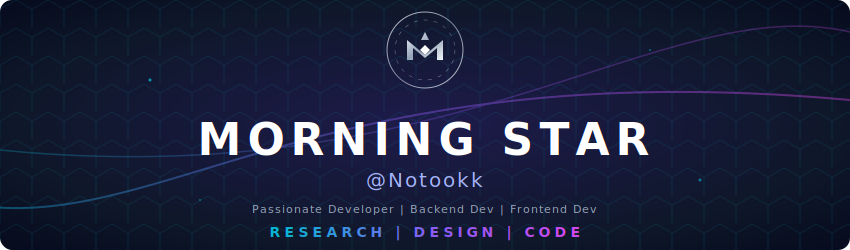

  

 

  
  &nbsp;&nbsp;
  
  &nbsp;&nbsp;
  

 

  

<h3 align="center">
  
</h3>

 

<table align="center" border="0" width="100%">
  <tr>
    <td align="center">
      <h3 align="center">⚡ 𝗟𝗔𝗡𝗚𝗨𝗔𝗚𝗘𝗦</h3>
      
      
      
      
      
      
      
    </td>
  </tr>
  <tr>
    <td align="center">
      <h3 align="center">🌌 𝗖𝗟𝗢𝗨𝗗 & 𝗛𝗢𝗦𝗧𝗜𝗡𝗚</h3>
      
      
      
      
      
      
      
    </td>
  </tr>
  <tr>
    <td align="center">
      <h3 align="center">🛠️ 𝗧𝗢𝗢𝗟𝗦 & 𝗙𝗥𝗔𝗠𝗘𝗪𝗢𝗥𝗞𝗦</h3>
      
      
      
      
      
      
      
    </td>
  </tr>
</table>

 

<h2 align="center">📊 𝗠𝗶𝘀𝘀𝗶𝗼𝗻 𝗦𝘁𝗮𝘁𝗶𝘀𝘁𝗶𝗰𝘀</h2>

<h2 align="center">🏆 𝗔𝗰𝗵𝗶𝗲𝘃𝗲𝗺𝗲𝗻𝘁𝘀</h2>

  

 

<!-- ⭐ NEW SECTION: CONTRIBUTOR STATS -->
<h2 align="center">👥 𝗧𝗼𝗽 𝗖𝗼𝗻𝘁𝗿𝗶𝗯𝘂𝘁𝗼𝗿 𝗦𝘁𝗮𝘁𝘀</h2>

  

 

<!-- ⭐ NEW SECTION: DEV QUOTE -->
<h2 align="center">📜 𝗗𝗲𝘃 𝗤𝘂𝗼𝘁𝗲 𝗼𝗳 𝘁𝗵𝗲 𝗗𝗮𝘆</h2>

  

 

  

 

<h3 align="center">🎧 𝗡𝗲𝘂𝗿𝗮𝗹 𝗟𝗶𝗻𝗸 𝗙𝗿𝗲𝗾𝘂𝗲𝗻𝗰𝘆</h3>

  

 

  

